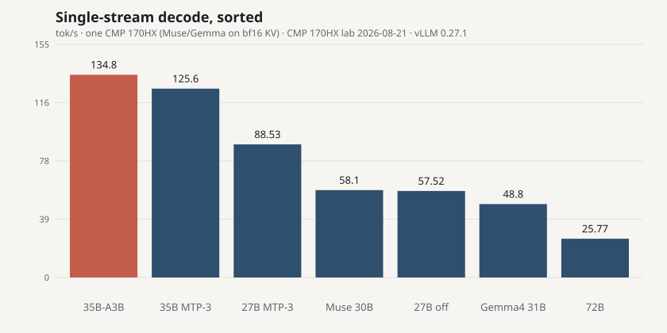
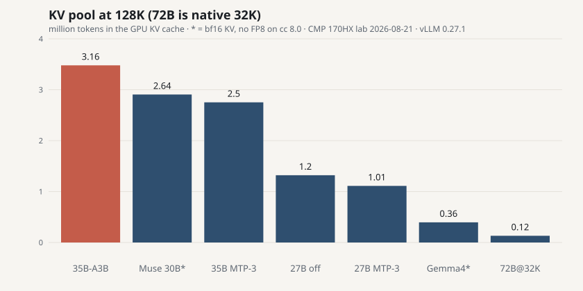
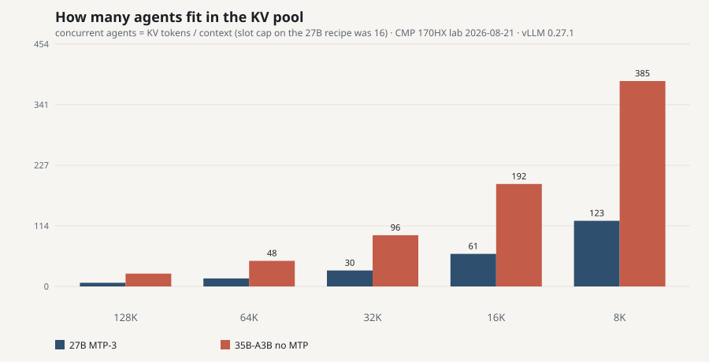
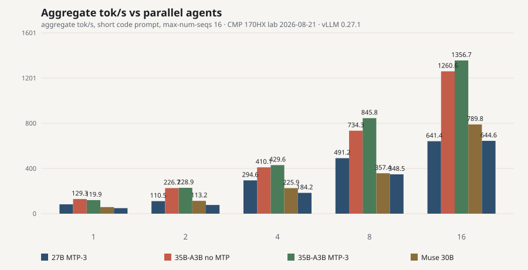
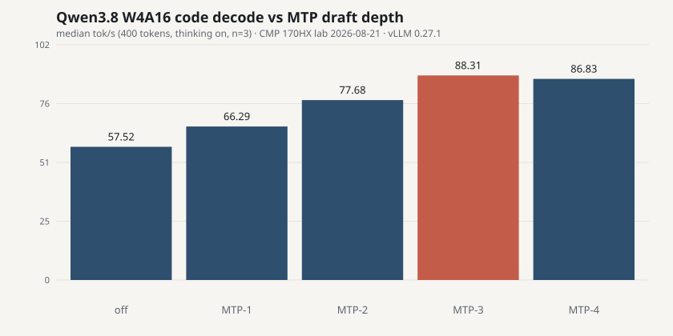
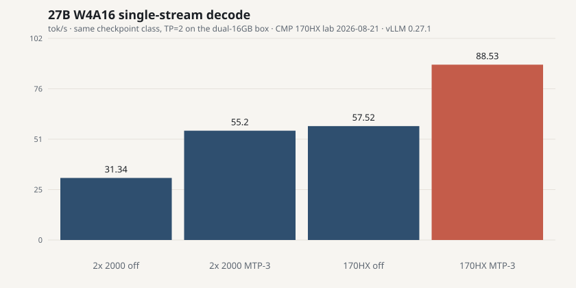
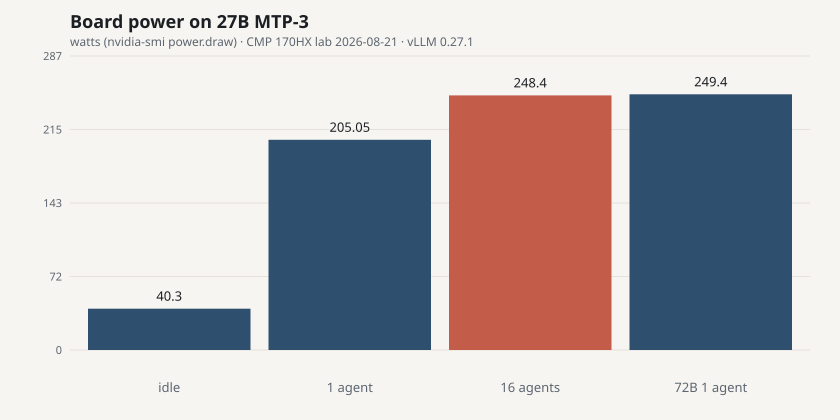
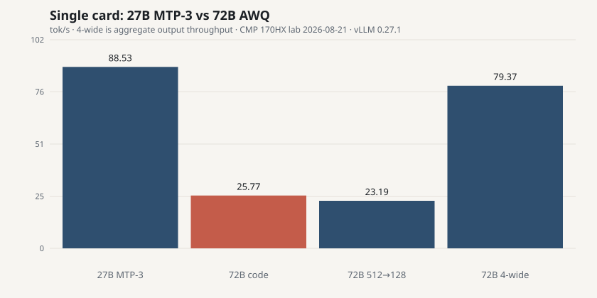
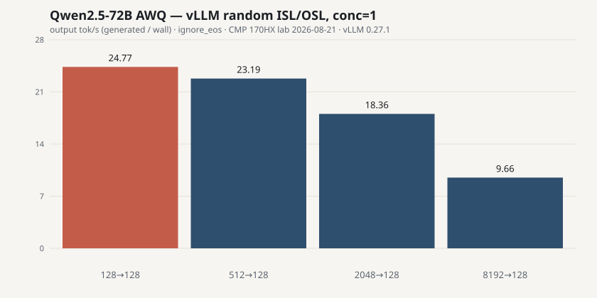

# CMP 170HX inference lab

Unlocked NVIDIA **CMP 170HX** (GA100, 64 GB HBM2e) measured as a local LLM card, 2026-08-21.

**Short answer:** after the community unlock, this is a 64 GB Ampere mining SKU, not an A100 and not a 5090. **1 500–1 800 € plus unlock plus hardware plus a real cooler is the hype price, not the measured one.**

Full numbers: [`results/lab-2026-08-21.json`](results/lab-2026-08-21.json) · scripts: [`scripts/`](scripts/) · unlock caveats: [`docs/UNLOCK-AND-MODS.md`](docs/UNLOCK-AND-MODS.md) · skips: [`docs/UNSUPPORTED.md`](docs/UNSUPPORTED.md) · secrets: [`SECURITY.md`](SECURITY.md)

This repo has **no hostnames, IPs, accounts, or private checkpoints**. Scripts default to `http://127.0.0.1:8000`.

## Sorted overview (one card, vLLM 0.27.1)

Public AWQ checkpoints. FP8 KV except where noted. Decode is median tok/s, thinking-on unless a gate required otherwise.

| Rank | Model | Fit | Single tok/s | 16-agent agg | KV @ native window | Notes |
|---|---|---|---|---|---|---|
| 1 | **Qwen3.6 35B-A3B** AWQ (~3B active) | 22.9 GiB | **134.8** | **1 261** | **3.16M / 24.1× @ 128K** | Hybrid GDN+MoE. MTP-3 is *slower* single-stream (125.6), 16-agent 1 357 |
| 2 | Qwen3.8 **27B** W4A16 MTP-3 | 18.6 GiB | **88.3** | **641** | 1.01M / 7.73× @ 128K | Best 27B depth. No-MTP: 57.5 tok/s, 1.20M KV |
| 3 | Qwen2.5 **72B** AWQ | 38.8 GiB | **25.8** | 100 @ 4-wide | 0.12M / 3.78× @ **32K** | vLLM refused 128K. Already ~250 W on one stream |
| — | Gemma 4 **31B** AWQ | 20 GiB on disk | — | — | — | **Did not serve** on 0.27.1. [Why](docs/UNSUPPORTED.md) |
| — | Muse Glimmer **30B** W4A16 | not downloaded | — | — | — | **Not in** vLLM 0.27.1. [Why](docs/UNSUPPORTED.md) |

Same 27B recipe on **2× RTX PRO 2000 16 GB**, TP=2, no NVLink: 31 tok/s (off) / 55 tok/s (MTP-3). That box cannot load 72B AWQ.









## Qwen3.6 35B-A3B (the new number)

`cyankiwi/Qwen3.6-35B-A3B-AWQ-4bit`, 6/6 shards hash-checked against Hub LFS. Native 256K, vision encoder present, served as text at 128K.

| | No MTP | MTP-3 |
|---|---|---|
| Load | 22.87 GiB in 45 s | 23.38 GiB in 49 s |
| KV | 3 159 025 · 24.10× @ 128K | 2 502 283 · 19.09× @ 128K |
| Single decode | **134.8 tok/s** · TTFT 40 ms | 125.6 tok/s · TTFT 68 ms |
| 16 agents | 1 261 tok/s agg · ~190 W | 1 357 tok/s agg · ~191 W |
| Packing 128K→8K | 24 / 48 / 96 / 192 / **385** | 19 / 38 / 76 / 152 / 305 |

MTP does not win here the way it did on dense 27B. Use **no MTP** unless you are filling 16 slots.

Power: idle ~43 W; 1 agent ~158 W at 135 tok/s. The 250 W cap is not the story on this MoE.

## Qwen3.8 27B (dense, MTP helps)

| Workload | Result |
|---|---|
| No MTP | 57.5 tok/s · TTFT 82 ms · KV 1.20M @ 128K |
| **MTP-3** (best depth) | **88.3 tok/s** code · 81.8 tok/s prose · 641 tok/s @ 16 agents |
| MTP depths 1/2/3/4 | 66.3 / 77.7 / **88.3** / 86.8 tok/s — plateau at 3 |
| 256K window | KV 1.10M · 4.2× @ 262144 · exact needle at **200k** tokens |
| Real JPEG vision | “Dog” in **465 ms** TTFT (text is ~100 ms) |
| Power | idle 40 W · 1 agent 205 W · 16 agents 248–253 W |







## Qwen2.5 72B AWQ (it fits, it crawls)

**38.8 GiB** in 20 s · **25.8 tok/s** · native **32K** only · 250 W on one stream.

vLLM random ISL/OSL: 25 / 23 / 18 / **10** tok/s at 128 / 512 / 2k / 8k →128; 4-wide **79** tok/s.





70B-class write-up: [`docs/70B.md`](docs/70B.md).

PCIe ×16 vs ×4: H2D **6.63 vs 1.7 GB/s**. Decode and prefill did **not** move. Pay for the solder mod only if you care about load, KV restore, and vision H2D.

## Should you pay 1 500–1 800 €?

Prices jumped when the unlock went public ([Wccftech](https://wccftech.com/nvidia-cmp-170hx-8-10-gb-prices-explode-over-1000-usd-as-tool-unlocks-hidden-64-80gb-vram/)). Listings in that band are selling an A100 story.

You still need:

1. **Software unlock** ([cmpunlocker](https://github.com/amoghmunikote/cmpunlocker)) — or a seller who already did it. Verify `65536 MiB` *and* a compute microbench. 8 GB SKU → 64 GB; 10 GB SKU → ~40 GB stable, not 80 GB.
2. **Optional hardware:** 24× 0402 AC-coupling capacitors for PCIe ×16. Gen2 *speed* is software; *width* is solder ([wiki](https://github.com/Consensus-Protocol/cmp170hx)).
3. **Cooling.** 250 W, mining blower, no display. A silent desktop without a proper cooler is the part the price tag pretends is free.

Reddit field threads (hype included):

- [Unlock 8 GB → 64 GB](https://www.reddit.com/r/LocalLLaMA/comments/1v0a7wn/)
- [Field reports](https://www.reddit.com/r/LocalLLaMA/comments/1vbf1s0/)

If you want 64 GB in one slot for a lab, this card can make sense **far below** A100 money. If you want a 24/7 27B appliance, a 70 W-class dual-16GB box is still the boring winner on tokens/watt. If you want **~30B-class MoE** at 135 tok/s and a 3M-token KV pool, the 170HX suddenly looks like the point of 64 GB.

## Reproduce

See [`docs/METHODOLOGY.md`](docs/METHODOLOGY.md). Figures:

```bash
python3 scripts/plot_results.py
```

After a Hub download, hash-check shards:

```bash
python3 scripts/verify_hf_dir.py --repo org/name --dir /path/to/snapshot
```

## Not in this repo

Unlock patches, exploit write-ups, cloud IPs, private model hashes, LinkedIn copy, or a how-to for bypassing vendor locks beyond pointing at the public tools above.
