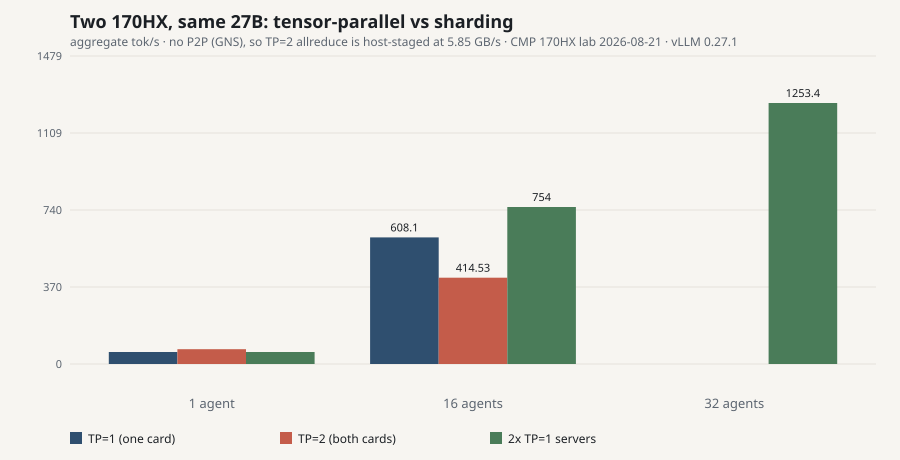
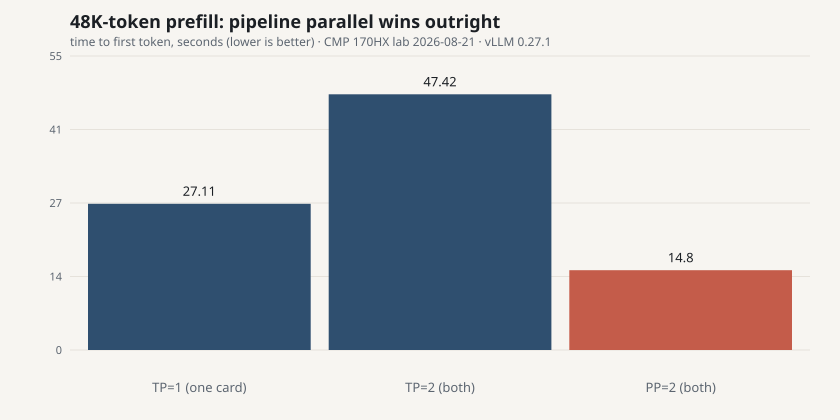
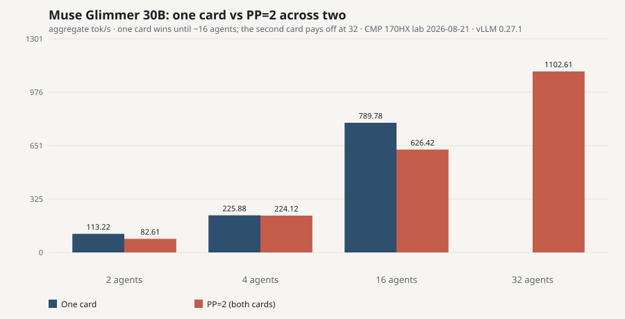

# CMP 170HX inference lab

Unlocked NVIDIA **CMP 170HX** (GA100, 64 GB HBM2e) measured as a local LLM card, 2026-08-21.

**Short answer:** after the community unlock, this is a 64 GB Ampere mining SKU, not an A100 and not a 5090. **1 500–1 800 € plus unlock plus hardware plus a real cooler is the hype price, not the measured one.**

Full numbers: [`results/lab-2026-08-21.json`](results/lab-2026-08-21.json) · scripts: [`scripts/`](scripts/) · unlock caveats: [`docs/UNLOCK-AND-MODS.md`](docs/UNLOCK-AND-MODS.md) · skips: [`docs/UNSUPPORTED.md`](docs/UNSUPPORTED.md) · secrets: [`SECURITY.md`](SECURITY.md)

This repo has **no hostnames, IPs, accounts, or private checkpoints**. Scripts default to `http://127.0.0.1:8000`.

## Sorted overview (one card)

Public 4-bit checkpoints. Decode is median tok/s, thinking-on unless a gate required otherwise. The Qwen rows are the frozen **vLLM 0.27.1** recipe with FP8 KV; Muse and Gemma need a newer engine and **bf16 KV** (details below).

| Rank | Model | Fit | Single tok/s | 16-agent agg | KV @ native window | Notes |
|---|---|---|---|---|---|---|
| 1 | **Qwen3.6 35B-A3B** AWQ (~3B active) | 22.9 GiB | **134.8** | **1 261** | **3.16M / 24.1× @ 128K** | Hybrid GDN+MoE. MTP-3 is *slower* single-stream (125.6), 16-agent 1 357 |
| 2 | Qwen3.8 **27B** W4A16 MTP-3 | 18.6 GiB | **88.3** | **641** | 1.01M / 7.73× @ 128K | Best 27B depth. No-MTP: 57.5 tok/s, 1.20M KV |
| 3 | **Muse Glimmer 30B** W4A16 | 21.0 GiB | 58.1 | **790** | 2.64M / 20.1× @ 128K | Best single-card aggregate; **1 103** on two cards at PP=2. Needs a dev-branch vLLM |
| 4 | **Gemma 4 31B** QAT W4A16 | 19.8 GiB | 48.8 | 645 | 0.36M / 2.71× @ 128K | Official QAT checkpoint. Chat endpoint only |
| 5 | Qwen2.5 **72B** AWQ | 38.8 GiB | **25.8** | 100 @ 4-wide | 0.12M / 3.78× @ **32K** | vLLM refused 128K. Already ~250 W on one stream |
Same 27B recipe on **2× RTX PRO 2000 16 GB**, TP=2, no NVLink: 31 tok/s (off) / 55 tok/s (MTP-3). That box cannot load 72B AWQ.


## Qwen3.6 35B-A3B (the new number)

`cyankiwi/Qwen3.6-35B-A3B-AWQ-4bit`, 6/6 shards hash-checked against Hub LFS. Native 256K, vision encoder present, served as text at 128K.

| | No MTP | MTP-3 |
|---|---|---|
| Load | 22.87 GiB in 45 s | 23.38 GiB in 49 s |
| KV | 3 159 025 · 24.10× @ 128K | 2 502 283 · 19.09× @ 128K |
| Single decode | **134.8 tok/s** · TTFT 40 ms | 125.6 tok/s · TTFT 68 ms |
| 16 agents | 1 261 tok/s agg · ~190 W | 1 357 tok/s agg · ~191 W |
| Packing 128K→8K | 24 / 48 / 96 / 192 / **385** | 19 / 38 / 76 / 152 / 305 |

MTP does not win here the way it did on dense 27B. Use **no MTP** unless you are filling 16 slots.

Power: idle ~43 W; 1 agent ~158 W at 135 tok/s. The 250 W cap is not the story on this MoE.

## Qwen3.8 27B (dense, MTP helps)

| Workload | Result |
|---|---|
| No MTP | 57.5 tok/s · TTFT 82 ms · KV 1.20M @ 128K |
| **MTP-3** (best depth) | **88.3 tok/s** code · 81.8 tok/s prose · 641 tok/s @ 16 agents |
| MTP depths 1/2/3/4 | 66.3 / 77.7 / **88.3** / 86.8 tok/s — plateau at 3 |
| 256K window | KV 1.10M · 4.2× @ 262144 · exact needle at **200k** tokens |
| Real JPEG vision | “Dog” in **465 ms** TTFT (text is ~100 ms) |
| Power | idle 40 W · 1 agent 205 W · 16 agents 248–253 W |


## Muse Glimmer 30B and Gemma 4 31B (what the frozen recipe could not do)

Both were listed as “did not serve” on vLLM 0.27.1. Neither was a VRAM problem — both were engine problems, and both now run on the same card.

What actually had to change:

1. **A newer vLLM**, installed in a **second venv** so the measured 0.27.1 numbers above stay reproducible. `MuseGlimmer*` and `Gemma4*` are in that build's registry; 0.27.1 has no Muse class at all.
2. **The right Gemma checkpoint.** The AWQ community repack trips a per-layer `head_dim` mismatch. The official **QAT compressed-tensors** build (`google/gemma-4-31B-it-qat-w4a16-ct`) loads clean.
3. **`--kv-cache-dtype bfloat16`, not fp8.** Ampere cc 8.0 has no native `fp8e4nv`, so Triton attention refuses FP8 KV outright. This costs pool size and is the single biggest reason Gemma's KV looks small.
4. **`VLLM_USE_FLASHINFER_SAMPLER=0`.** FlashInfer's JIT could not build its `sm_80` kernels against the CUDA headers in that wheel — it failed for attention *and* again, later, for sampling. The torch sampler sidesteps it.

| | Muse Glimmer 30B | Gemma 4 31B QAT |
|---|---|---|
| Load | 21.02 GiB in 8.5 s | 19.78 GiB in 8.6 s |
| KV @ 128K | **2 635 350** · 20.11× | 355 128 · 2.71× |
| TTFT | 78 ms | **29 ms** |
| Single decode | **58.1 tok/s** | 48.8 tok/s |
| 4 / 8 / 16 agents | 226 / 357 / **790** tok/s | 184 / 348 / 645 tok/s |
| Prefill ~48–53K | 33.6 s | 60.9 s |
| Power 1 / 16 agents | 222 W / 249 W | 235 W / 250 W |

**790 tok/s aggregate is the highest single-card number in this lab** — higher than the 35B MoE at 16 agents on raw decode, though the MoE still wins on single-stream latency and KV depth. Given a second card it goes further still: [1 103 tok/s at PP=2](#muse-on-two-cards-the-fastest-endpoint-in-the-lab).

Gemma caveat: query it through **`/v1/chat/completions`**. Raw `/v1/completions` on this instruction/thinking checkpoint degenerates into repeated tokens. Its 128K window is nominal — with bf16 KV the pool only holds ~2.7 full contexts.

These two rows are **not directly comparable** to the Qwen rows: different engine, and bf16 KV roughly halves the pool against FP8. Serve commands and the accuracy gaps: [`docs/METHODOLOGY.md`](docs/METHODOLOGY.md).

## Two cards: TP=2 is a trap without P2P

A second rental put **2× 170HX** in one box (128 GB, both Gen2 ×16, `PHB` topology). Same engine, same checkpoint, same flags as the single-card 27B run — the only variable is how the model is split across the two cards.

| | TP=1 (one card) | TP=2 (both) | PP=2 (both) | Two TP=1 servers |
|---|---|---|---|---|
| Single decode | 57.5 tok/s | **70.9** (+23%) | 57.5 | 57.5 |
| 16 agents | 608 tok/s | 415 (−32%) | 605 | **754** |
| 32 agents | — | — | 895 | **1 253** |
| KV pool @128K | 1.19M / 9.1× | **2.98M / 22.8×** | 2.76M / 21.1× | 1.19M per server |
| 48K prefill | 27.1 s | 47.4 s (−75%) | **14.8 s** (1.8× faster) | 27.1 s |

**TP=2 makes one stream faster and everything else slower.** The crossover is around 3 agents.



The cause is in `nvidia-smi topo -p2p`: **`GNS` — GPU not supported**. Peer-to-peer is fused off in the CMP SKU, not blocked by IOMMU or ACS, so nothing in BIOS or the kernel recovers it. `torch.cuda.can_device_access_peer` is `False` both ways, device-to-device copies are host-staged at **5.85 GB/s** (no faster than the 6.17 GB/s H2D), and vLLM logs it plainly:

> Custom allreduce is disabled because your platform lacks GPU P2P capability

Every layer's allreduce then crawls over the host bridge. Allreduce payload scales with batch size, so the penalty grows exactly where you wanted the second card to help.

**If you are throughput-bound, do not use TP=2.** Run one TP=1 server per card behind a load balancer: **1 253 tok/s vs 415**, a **3.0×** win on identical silicon.

### Pipeline parallel is the setting we should have reached for first

`--pipeline-parallel-size 2` splits the model by **layer**, not by tensor. The only inter-GPU traffic is one activation handoff at the stage boundary, instead of an allreduce inside every layer — precisely the traffic that the dead link punishes. Same checkpoint, same flags, one word changed:

| vs TP=2 | PP=2 result |
|---|---|
| 16 agents | **605 tok/s** vs 415 — **1.46×** |
| 32 agents | **895 tok/s** — TP=2 could not scale here at all |
| 48K prefill | **14.8 s** vs 47.4 s — **3.2×** faster |
| KV pool | 2.76M tokens (21.1×) — within 7% of TP=2 |



**PP=2 matches a single card's throughput (605 vs 608 tok/s) while holding 2.3× the KV pool.** That is the combination we wanted from the second card and failed to get from TP=2: full speed *and* the capacity. Prefill is better than either alternative — even 1.8× faster than one card, since the stages overlap across a long prompt.

The one thing it gives up is TP=2's single-stream gain: 57.5 tok/s, identical to one card. Pipeline parallel does not split per-token weight reads, so a lone request sees no extra bandwidth.

**Practical ranking on a P2P-less box:** sharding for raw throughput → **PP=2** when you want depth without losing speed → TP=2 only for single-stream latency or a model that will not fit.

### Muse on two cards: the fastest endpoint in the lab

Pairing the best model with the best dual-card mode. Muse Glimmer 30B at PP=2, bf16 KV, dev-branch vLLM:

| | one card | PP=2 (both) |
|---|---|---|
| 16 agents | **790 tok/s** | 626 |
| 32 agents | — | **1 103 tok/s** |
| KV pool @128K | 2.64M / 20.1× | **5.25M / 40.1×** |
| TTFT | 77.7 ms | **26.0 ms** |
| 53K prefill | 33.6 s | **18.1 s** |

**1 103 tok/s at 32 agents is the highest single-endpoint throughput measured here**, and the 5.25M-token KV pool is the deepest — 40 full 128K contexts resident at once, even though cc 8.0 forces bf16 KV on this checkpoint. Latency improves too: TTFT drops to **26 ms** from 77.7 ms, and a 53K prefill runs **1.9× faster** (18.1 s vs 33.6 s), the same pipeline-overlap effect seen on Qwen.



But note the row that does not flatter the second card: **at 16 agents one card is faster** (790 vs 626). The second card only pays off past ~16 concurrent agents, or when you want the deeper pool. Power confirms PP=2 keeps both cards genuinely working — 422 W at 32 agents, rising with load, the opposite of the 72B TP=2 run where heavy batch drove power *down* because the cards sat blocked on the interconnect.

### Does the second card earn its keep on a 72B?

We asserted "use TP=2 when it does not fit", then measured it. Qwen2.5 72B AWQ (39 GiB of weights) at TP=2, 32K window, FP8 KV:

| | one card | two cards, TP=2 |
|---|---|---|
| Single-stream decode | 25.8 tok/s | **37.1 tok/s** (+44%) |
| KV pool | cramped at 32K | **494 848 tokens** (15.1× concurrency) |
| 16 agents | — | 275 tok/s (17.8 per agent) |
| 32 agents | — | 360 tok/s (11.6 per agent) |
| 24K prefill | — | 51.0 s |

The second card buys **headroom, not speed**. 360 tok/s at 32 agents is still below what a *single* card does with 27B (608 tok/s at 16). Power inverts what you would guess: **437 W** median on one stream, **304 W** at 32 agents — under batch the cards idle on the host-staged allreduce instead of computing.

**The context window is not a VRAM problem.** Asking for 128K was rejected outright: this checkpoint declares `max_position_embeddings=32768`, and the advertised 128K needs YaRN rope-scaling turned on explicitly. The 32K ceiling on one card was the *model's* limit all along. A second card does not extend context — only the KV pool at a given length.

Full data: [`results/dual-card-2026-08-21.json`](results/dual-card-2026-08-21.json).

## Qwen2.5 72B AWQ (it fits, it crawls)

**38.8 GiB** in 20 s · **25.8 tok/s** · native **32K** only · 250 W on one stream.

The 32K is the checkpoint's own `max_position_embeddings`, not a VRAM ceiling — confirmed when [two cards refused 128K too](#does-the-second-card-earn-its-keep-on-a-72b). A second card lifts this to 37.1 tok/s.

vLLM random ISL/OSL: 25 / 23 / 18 / **10** tok/s at 128 / 512 / 2k / 8k →128; 4-wide **79** tok/s.


70B-class write-up: [`docs/70B.md`](docs/70B.md).

PCIe ×16 vs ×4: H2D **6.63 vs 1.7 GB/s**. Decode and prefill did **not** move. Pay for the solder mod only if you care about load, KV restore, and vision H2D.

## Should you pay 1 500–1 800 €?

Prices jumped when the unlock went public ([Wccftech](https://wccftech.com/nvidia-cmp-170hx-8-10-gb-prices-explode-over-1000-usd-as-tool-unlocks-hidden-64-80gb-vram/)). Listings in that band are selling an A100 story.

You still need:

1. **Software unlock** ([cmpunlocker](https://github.com/amoghmunikote/cmpunlocker)) — or a seller who already did it. Verify `65536 MiB` *and* a compute microbench. 8 GB SKU → 64 GB; 10 GB SKU → ~40 GB stable, not 80 GB.
2. **Optional hardware:** 24× 0402 AC-coupling capacitors for PCIe ×16. Gen2 *speed* is software; *width* is solder ([wiki](https://github.com/Consensus-Protocol/cmp170hx)).
3. **Cooling.** 250 W, mining blower, no display. A silent desktop without a proper cooler is the part the price tag pretends is free.

Reddit field threads (hype included):

- [Unlock 8 GB → 64 GB](https://www.reddit.com/r/LocalLLaMA/comments/1v0a7wn/)
- [Field reports](https://www.reddit.com/r/LocalLLaMA/comments/1vbf1s0/)

If you want 64 GB in one slot for a lab, this card can make sense **far below** A100 money. If you want a 24/7 27B appliance, a 70 W-class dual-16GB box is still the boring winner on tokens/watt. If you want **~30B-class MoE** at 135 tok/s and a 3M-token KV pool, the 170HX suddenly looks like the point of 64 GB.

## Reproduce

See [`docs/METHODOLOGY.md`](docs/METHODOLOGY.md). Figures:

```bash
python3 scripts/plot_results.py
```

After a Hub download, hash-check shards:

```bash
python3 scripts/verify_hf_dir.py --repo org/name --dir /path/to/snapshot
```
