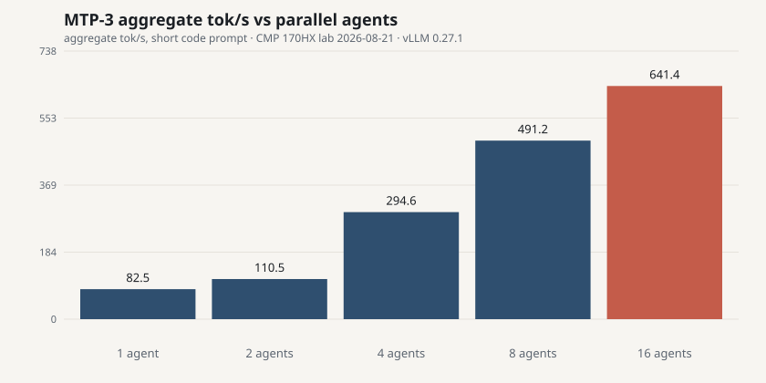

# CMP 170HX inference lab

Unlocked NVIDIA **CMP 170HX** (GA100, 64 GB HBM2e) measured as a local LLM card, 2026-08-21.

**Short answer:** after the community unlock, this is a 64 GB Ampere mining SKU, not an A100 and not a 5090. **1 500–1 800 € plus unlock plus hardware plus a real cooler is the hype price, not the measured one.**

Full numbers: [`results/lab-2026-08-21.json`](results/lab-2026-08-21.json) · scripts: [`scripts/`](scripts/) · unlock caveats: [`docs/UNLOCK-AND-MODS.md`](docs/UNLOCK-AND-MODS.md) · pros/cons: [`docs/PROS-CONS.md`](docs/PROS-CONS.md)

This repo has **no hostnames, IPs, accounts, or private checkpoints**. Scripts default to `http://127.0.0.1:8000`.

## What we measured

One card, already unlocked: 64 GB visible, FMA on, PCIe **Gen2 ×16** (width is *not* stock; see unlock notes). vLLM 0.27.1. Public AWQ checkpoints.

| Workload | Result |
|---|---|
| Qwen3.8 27B W4A16, no MTP | 57.5 tok/s · TTFT 82 ms · KV 1.20M @ 128K |
| Same, **MTP-3** (best depth) | **88.3 tok/s** code · 81.8 tok/s prose · 641 tok/s agg @ 16 agents |
| MTP depths 1/2/3/4 | 66.3 / 77.7 / **88.3** / 86.8 tok/s — plateau at 3 |
| 256K window | KV 1.10M · 4.2× @ 262144 · exact needle at **200k** tokens |
| Real JPEG vision | “Dog” in **465 ms** TTFT (text is ~100 ms) |
| Qwen2.5 **72B** AWQ | **38.8 GiB** in 20 s · **25.8 tok/s** · native **32K** only · 250 W on one stream |
| 72B vLLM random ISL/OSL | 25 / 23 / 18 / **10** tok/s at 128 / 512 / 2k / 8k →128; 4-wide **79** tok/s |
| Power (27B MTP-3) | idle 40 W · 1 agent 205 W · 16 agents 248–253 W |

Baseline on the same 27B recipe: **2× RTX PRO 2000 16 GB**, TP=2 over PCIe, no NVLink: 31 tok/s (no MTP) / 55 tok/s (MTP-3). That box cannot load 72B AWQ.

PCIe ×16 vs ×4: H2D **6.63 vs 1.7 GB/s**. Decode and prefill did **not** move. Pay for the solder mod only if you care about load, KV restore, and vision H2D.





70B-class write-up (why random ISL/OSL, not ShareGPT/MMLU): [`docs/70B.md`](docs/70B.md).

## Should you pay 1 500–1 800 €?

Prices jumped when the unlock went public ([Wccftech](https://wccftech.com/nvidia-cmp-170hx-8-10-gb-prices-explode-over-1000-usd-as-tool-unlocks-hidden-64-80gb-vram/)). Listings in that band are selling an A100 story.

You still need:

1. **Software unlock** ([cmpunlocker](https://github.com/amoghmunikote/cmpunlocker)) — or a seller who already did it. Verify `65536 MiB` *and* a compute microbench. 8 GB SKU → 64 GB; 10 GB SKU → ~40 GB stable, not 80 GB.
2. **Optional hardware:** 24× 0402 AC-coupling capacitors for PCIe ×16. Gen2 *speed* is software; *width* is solder ([wiki](https://github.com/Consensus-Protocol/cmp170hx)).
3. **Cooling.** 250 W, mining blower, no display. A silent desktop without a proper cooler is the part the price tag pretends is free.

Reddit field threads (hype included):

- [Unlock 8 GB → 64 GB](https://www.reddit.com/r/LocalLLaMA/comments/1v0a7wn/)
- [Field reports](https://www.reddit.com/r/LocalLLaMA/comments/1vbf1s0/)

If you want 64 GB in one slot for a lab, this card can make sense **far below** A100 money. If you want a 24/7 27B appliance, a 70 W-class dual-16GB box is still the boring winner on tokens/watt.

## Reproduce

See [`docs/METHODOLOGY.md`](docs/METHODOLOGY.md). Figures:

```bash
python3 scripts/plot_results.py
```

## Not in this repo

Unlock patches, exploit write-ups, cloud IPs, private model hashes, or a how-to for bypassing vendor locks beyond pointing at the public tools above.
